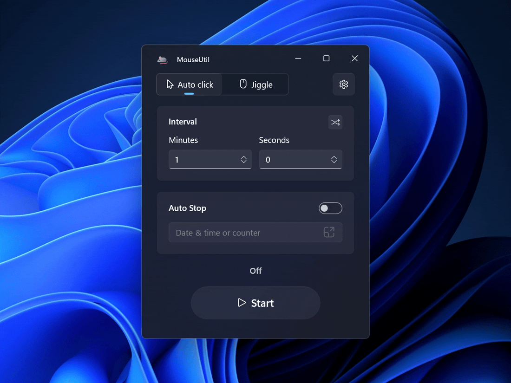

# MouseUtil

**MouseUtil** is a lightweight Windows utility that keeps your mouse "active" by clicking or
jiggling/moving in place, so your PC doesn't go idle, lock, or sleep during long calls,
downloads, or AFK sessions.



<a href="https://apps.microsoft.com/detail/9NTDCVFVF0SQ?referrer=appbadge&mode=full" target="_blank" rel="noopener noreferrer">
    <picture>
        <source media="(prefers-color-scheme: dark)" srcset="https://get.microsoft.com/images/en-us%20dark.svg">
        
    </picture>
</a>

### Modes

- **Auto click** — clicks at wherever the cursor currently is, without moving it.
- **Jiggle** — sweeps the cursor around a tiny circle and returns it to the exact starting pixel,
  without clicking.

### Features and options

- ⏱️ Configurable interval between actions, with an optional randomized range and an advanced
  Hours/Minutes/Seconds/Milliseconds view.
- ✋ Pause on manual movement — touching the mouse pauses the countdown instead of fighting you for
  control. Can be turned on independently for Auto click and/or Jiggle.
- 🛑 Auto-stop after a number of clicks/jiggles, or at a specific date and time.
- ⌨️ Global hotkey to start/stop from anywhere (F6 by default).
- 📊 Live countdown or action counter right on the Start/Stop button, plus an optional taskbar
  progress overlay.
- 📥 System tray icon with live status and a context menu to start/stop/pause without opening the
  window — optionally close to tray instead of exiting.
- 🚀 Run on system startup, with an independent "App launch behavior" (preferred mode, start
  automatically, randomize interval) applied on every launch.
- 🎨 Fluent design with light/dark/system theming, and Windows 11 Settings-style controls.
- ⚙️ Settings persist across runs (`%APPDATA%\MouseUtil\config.json`).

⚠️ **Fair warning**: I'm not a software developer. This project was developed primarily using
Claude Code, with me directing the architecture, reviewing the generated code, testing, and
making iterative improvements. All code in this repository has been reviewed before release. The
only asset not created with AI is the app icon, which I designed myself.

## Requirements

- Windows 10 20H1 (build 19041) or later, Windows 11 recommended.
- .NET 8 SDK, only if building from source.

## Build & run

```powershell
dotnet build MouseUtil.csproj -c Debug -p:Platform=x64
.\bin\x64\Debug\net8.0-windows10.0.19041.0\win-x64\MouseUtil.exe
```

## Build the installer

```powershell
dotnet build MouseUtil.csproj -c Release -p:Platform=x64
ISCC.exe installer\MouseUtil.iss
```

Output lands at `installer\Output\MouseUtilSetup.exe`.
